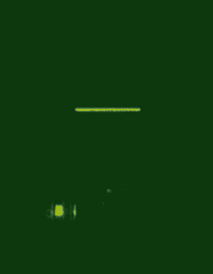

# esp32-filippo

Reply to Filippo's hand-written Arduino-sketch invite, running on the board.



## Concept

Filippo's postcard ends with `date = Serial.read();`. The board answers:

1. CRT power-on animation (dot, horizontal line, full flash) on the 0.42" OLED
2. Loading screen on white: mug icon, `cheers.exe`, thin progress bar
3. Beer with foam pours in from the bottom until the screen is black
4. Date carousel: one card centred, neighbours peeking in, dot indicators
   below; the BOOT button slides to the next card

Edit the dates in `DATES` in `src/main.cpp`.

## Hardware

[ESP32-C3 SuperMini with 0.42" OLED](https://de.aliexpress.com/item/1005007342383107.html)
(SSD1306, 72x40, I2C).

| Function | GPIO |
| -------- | ---- |
| OLED SDA | 5    |
| OLED SCL | 6    |
| LED      | 8    |
| BOOT btn | 9    |

## Build and flash

```sh
pio run -t upload
pio device monitor
```

If the board is not picked up, hold BOOT while plugging in USB, then upload.
